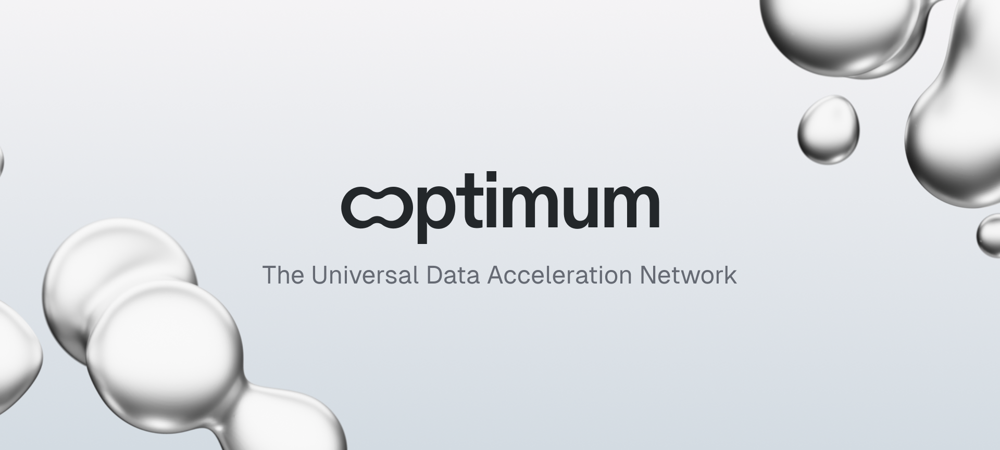
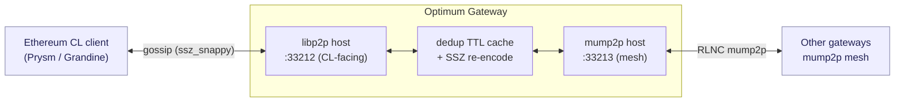

<div align="center">



[](https://github.com/getoptimum/optimum-gateway/actions/workflows/docker-publish.yml)
[](https://github.com/getoptimum/optimum-gateway/actions/workflows/security-scan.yml)
[](https://github.com/getoptimum/optimum-gateway/actions/workflows/integration.yml)
[](https://github.com/getoptimum/optimum-gateway/releases)
[](go.mod)
[](Makefile)
[](https://hub.docker.com/r/getoptimum/gateway)
[](https://github.com/getoptimum/optimum-gateway/actions/workflows/optimum-package.yml)
[](./LICENSE)

# Optimum Gateway

</div>

**Bridging Ethereum Consensus Layer gossip with the RLNC-enhanced mump2p mesh — for faster block & attestation propagation.**

> **Security:** see [`SECURITY.md`](SECURITY.md) for the trust model, the listener
> inventory with default binds and auth gates, and how to report vulnerabilities.

---

## Overview

The **Optimum Gateway (OG)** connects an Ethereum Consensus Layer (CL) client to the
**mump2p mesh** — a libp2p network running the RLNC-enhanced `mump2p` protocol.

It acts as:

- a **subscriber** to Ethereum libp2p gossip topics (`/eth2/<fork_digest>/.../ssz_snappy`);
- a **publisher/forwarder** of that traffic into the mump2p mesh; and
- a **receiver** of `mump2p` messages, re-encoding and re-injecting them into the local CL libp2p network.

The result is reduced propagation delay, improved validator rewards, and cross-network
latency telemetry — with **no changes required to the CL client** (it just peers with the gateway).

## Architecture



### Message flow

#### Ethereum CL → mump2p mesh

1. The gateway subscribes to the configured CL gossip topics via its local libp2p host.
2. Each message is fingerprinted (fast XXHash) and stored in a short TTL cache (≈1 min) for dedup.
3. The message is forwarded to connected mump2p peers (with optional aggregation batching for non-block topics).

#### mump2p mesh → Ethereum CL

1. A `mump2p` message arrives from a local or remote mump2p peer.
2. If its hash is already in the TTL cache, it is ignored; otherwise it is SSZ-decoded.
3. It is re-encoded and published to the local libp2p network for CL propagation, and telemetry is recorded.

## The RLNC coder sidecar

The gateway does not encode RLNC in process. The coder runs in a separate
`getoptimum/rlnc-server` container and the two talk over shared-memory lanes in
`/dev/shm`. This is structural, not a deployment preference: `getoptimum/rlnc` and
the vendored `pkg/rlncpb` both register protobuf descriptors under
`getoptimum/rlnc/types/v1/`, and the protobuf registry keys on file path, so linking
both panics at init. There is no in-process option.

**The sidecar is a hard runtime requirement.** The router drops every publish whose
encode fails, so a gateway without a coder is a silently dead publisher. Node
construction therefore fails rather than starting in that state:

```
attach RLNC coder shared memory "mump2p-protocol": no lane file at
/dev/shm/go_shm_rlnc_semaphore_mump2p-protocol_lane_0, so no rlnc-server is serving
"mump2p-protocol" with 20 lanes; run getoptimum/rlnc-server:v0.10.0 with
--name=mump2p-protocol --lanes=20 and share its /dev/shm with the gateway: ...
```

A lane file that exists but is the wrong size, or one owned by another user, gets
its own message naming the cause.

| Setting | Value | Why |
| --- | --- | --- |
| Coder image | `getoptimum/rlnc-server:v0.10.0` | Pinned in the `Makefile` (`RLNC_IMAGE_VERSION`) and repeated as the compose default. Coder and `mump2p-protocol` share a shared-memory wire format, so an unpinned coder against a pinned protocol is a compatibility hazard. |
| Lanes | `20` | The `mump2p-protocol` default the gateway uses. Override with `shm_lanes` / `OPT_SHM_LANES` and the sidecar's `--lanes` together. |
| Shared-memory name | `mump2p-protocol` | The sidecar's `--name` and the gateway's `shm_name` / `OPT_SHM_NAME` must match. |
| `/dev/shm` size | **320 MiB minimum, 512 MiB configured** | Each lane is one file of `24 + 2 x 8 MiB = 16777240` bytes, so 20 lanes need 335,544,800 bytes. Docker's default `/dev/shm` is 64 MiB, which is not close to enough. |

The compose files give the pair a shared `tmpfs` volume mounted at `/dev/shm`, sized
via `RLNC_SHM_SIZE` (default `512m`). The gateway waits on the sidecar's healthcheck,
which watches for the last lane file.

## Quick start

### Run with Docker

The simplest path is the bundled Compose file, which starts the gateway and its
RLNC coder together:

```sh
make run_local
# or, with the pin taken from the compose defaults:
docker compose -f docker-compose-local.yml up
```

To run the gateway image directly, the coder has to be started first and both have
to see the same `/dev/shm`:

```sh
docker volume create --driver local \
  --opt type=tmpfs --opt device=tmpfs --opt o=size=512m coder_shm

docker run --name optimum-rlnc-coder -d \
  -v coder_shm:/dev/shm \
  getoptimum/rlnc-server:v0.10.0 \
  --name=mump2p-protocol --lanes=20 --output-reclaim-after=5s

docker run --name optimum-gateway --rm \
  -p 33212:33212/tcp \
  -p 33213:33213/tcp \
  -p 48123:48123/tcp \
  -v coder_shm:/dev/shm \
  -v $(pwd)/config:/app/config \
  -v $(pwd)/data/libp2p:/tmp/libp2p \
  -v $(pwd)/data/mump2p:/tmp/mump2p \
  getoptimum/gateway:latest \
  -config=/app/config/app_conf.yml
```

`agent_mump2p_port` (default `33213`) must be reachable by other gateways in the mesh.

### Run from source

Requires **Go 1.26+**.

```sh
git clone https://github.com/getoptimum/optimum-gateway
cd optimum-gateway
cp config/sample.app_conf.yml config/app_conf.yml
make build       # builds ./bin/optimum-gateway
make rlnc_start  # RLNC coder sidecar against the host /dev/shm; required before `make run`
make run         # go run cmd/main.go -config config/app_conf.yml
make rlnc_stop   # tears the coder down again
```

### Connect your CL client

Fetch the gateway peer info and point your beacon node at it:

```sh
curl -s http://localhost:48123/api/v1/self_info | jq '{peer_id, multiaddrs: .libp2p.multiaddrs}'
```

```sh
# Example Prysm flag
--peer=/ip4/<YOUR_GATEWAY_IP>/tcp/33212/p2p/<YOUR_GATEWAY_PEER_ID>
```

A full validator-facing walkthrough lives in [`guide.md`](guide.md).

## Configuration

The gateway is configured via a YAML file (`config/app_conf.yml`) or environment
variables; **env vars override YAML**. A minimal config:

```yaml
api_key: ogw_live_****         # given by optimum team
gateway_cluster_id: ****       # given by optimum team
log_level: info
chain: hoodi                   # or: mainnet
identity_libp2p_dir: /tmp/libp2p
identity_mump2p_dir: /tmp/mump2p
agent_lib_p2p_port: 33212     # CL-facing libp2p
agent_mump2p_port: 33213     # mump2p mesh (gateway-to-gateway)
telemetry_enable: true
telemetry_port: 48123

```

See [`config/sample.app_conf.yml`](config/sample.app_conf.yml) and the
[versioned documentation](docs/versions/) for the full reference.

## APIs

The gateway exposes an HTTP server on `telemetry_port` (default `48123`):

| Endpoint                | Description                                                                                                                 |
| ----------------------- | --------------------------------------------------------------------------------------------------------------------------- |
| `GET /health`           | Structured health check (CL peers, mesh peers, subscribed topics, last block age) — returns `200`/`503` for load balancers. |
| `GET /api/v1/self_info` | Peer info: `peer_id`, multiaddrs, fork digest, chain, peer counts, version/commit.                                          |
| `GET /metrics`          | Prometheus metrics (only when `telemetry_enable: true`).                                                                    |
| `GET /`                 | Liveness root.                                                                                                              |

```sh
curl -s http://localhost:48123/health | jq
curl -s http://localhost:48123/api/v1/self_info | jq '.mump2p.total_peers'
```

## Local development (Prysm)

Generate an identity and run a CL client locally against the gateway:

```sh
go run cmd/generate_identity/main.go
curl https://raw.githubusercontent.com/OffchainLabs/prysm/master/prysm.sh --output prysm.sh && chmod +x prysm.sh && ./prysm.sh beacon-chain generate-auth-secret
mv jwt.hex /home/<USER>/local_cl/local_eth/jwt
make run_cl     # brings up the CL dependency via docker compose
```

Run Prysm as a binary against Hoodi (sync from a checkpoint):

```sh
cd prysm
go run ./cmd/beacon-chain/ \
  --execution-endpoint=http://0.0.0.0:8551 --hoodi \
  --jwt-secret=/home/<USER>/local_cl/local_eth/jwt/jwt.hex \
  --checkpoint-sync-url=https://hoodi.beaconstate.info \
  --genesis-beacon-api-url=https://hoodi.beaconstate.info \
  --peer=<GATEWAY_MULTIADDRESS> --accept-terms-of-use
```

For debugging Prysm from source, patch the flags noted in [`guide.md`](guide.md) and run the `TestGatewayReal` integration test.

## Make targets

```sh
make help        # list all targets
make build       # build the binary
make test        # unit + integration tests with coverage
make lint        # golangci-lint
make vulcheck    # govulncheck (with documented exception list)
```

## Documentation

- [Integration guide for validators](guide.md)
- [Versioned docs & release notes](docs/versions/)
- [Changelog](docs/CHANGELOG.md)
- [Security model](SECURITY.md)

## Contributing

See [`docs/contributing.md`](docs/contributing.md). Please run `make lint` and
`make test` before opening a PR, and report security issues privately per
[`SECURITY.md`](SECURITY.md) rather than via public issues.

## License

Source is provided under the **Microsoft Reference Source License (Ms-RSL)** for reference use only: see [`LICENSE`](./LICENSE).
