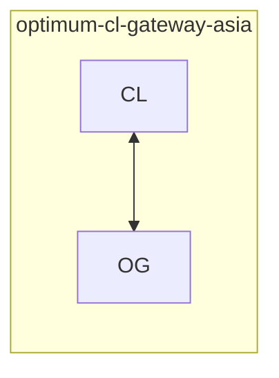
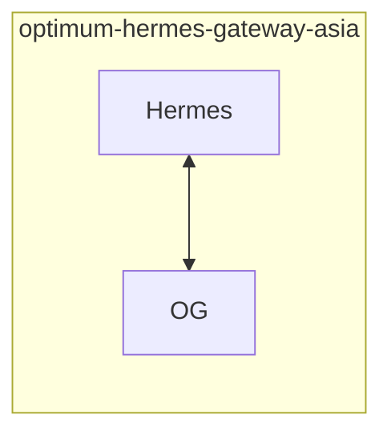
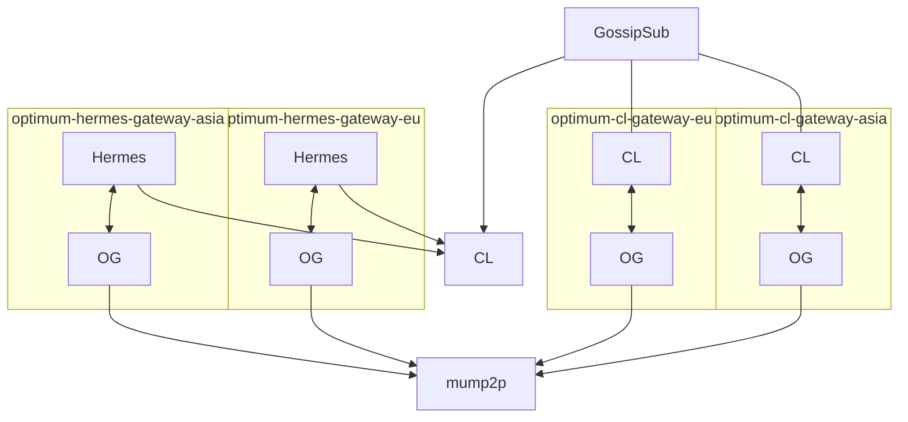
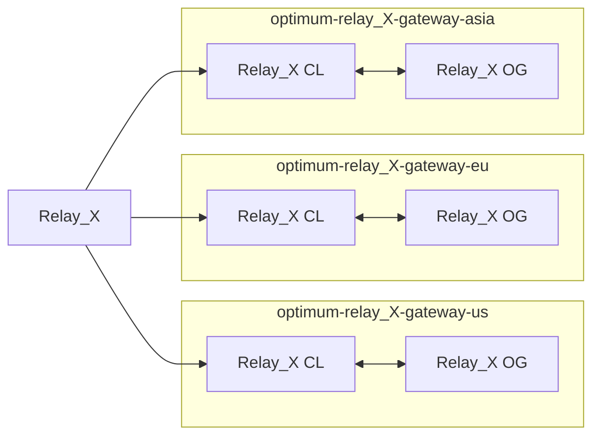
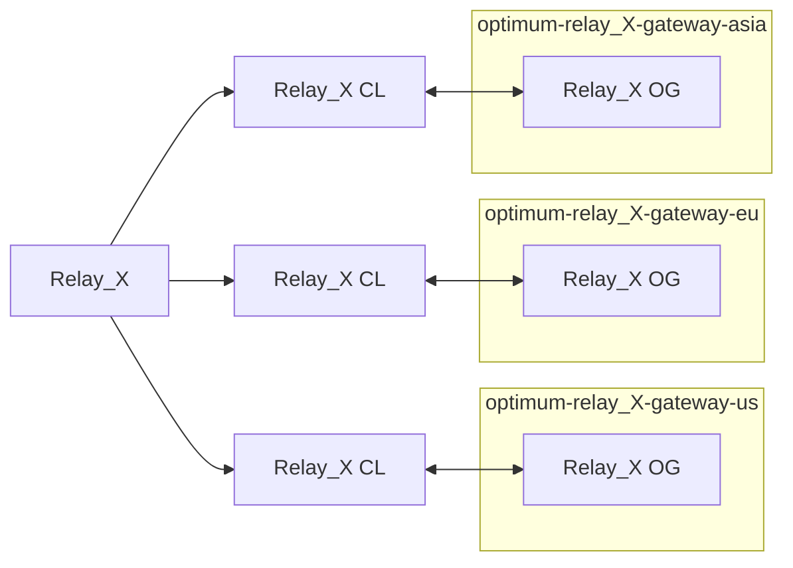
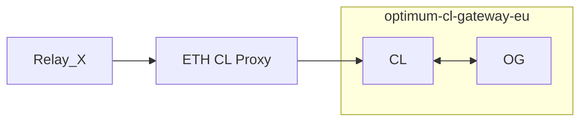

# ADR-0005: Block Ingestion Tracing and Source Impact Analysis

**Status:** Approved
**Date:** 2026-02-17

---

## Goal

In this ADR we describe the process to follow in order to compute the time a block is received at a node in the mump2p network and from which origin. Further analysis on the captured data aims to reveal the impact of each individual ingestion methodology as well as the degradation of an ingestion pipeline.

## Context

This ADR extends [ADR-0004](./0004-hop-by-hop-latency-tracking.md). ADR-0004 established:

* How to measure the hop-by-hop latency
* How to trace the hop-by-hop traversal of a block among mump2p gateways

ADR-0004 essentially captures what happens to a block inside the mump2p network

### Current Ingestion Tracking

Optimum propagation solution, aka mump2p, is integrated with Ethereum to expedite the propagation of messages among the Ethereum validators with the potential to increase their overall rewards. 

One of the critical procedures for mump2p to be effective, is to capture the blocks being proposed and inject them into the mump2p network for faster delivery. We currently have the following block capturing methodologies in place:

* `CL Nodes(CLN)`: Consensus layer (CL) nodes take part on the Ethereum’s network mesh and implement a gossipsub component to propagate proposed blocks in the network. Beacon nodes are connected to a single Execution Layer (EL)/Consensus Layer CL node. So they either:
    * publish a block proposed by the CL client they are connected to
    * receive a block from the Gossipsub network and forward it to its neighbors and the connected CL/EL node.
    
    It is important to note that EL/CL nodes are computationally powerful devices that require substantial resources to operate effectively.
    
* `Relay Nodes(RN)`: Relay nodes are either builders in the Ethereum ecosystem that produce blocks and send them to validators for proposal, or forwarder nodes that push blocks to their subscribers.
* `Hermes Nodes(HN)`: Lightweight nodes that mainly run Gossipsub protocol to capture the blocks propagated in the network. In contrast to CL nodes, multiple hermes nodes may be integrated with a single CL/EL node.

The design integrates with a set of external relay providers, referred to generically below as `Relay X`, `Relay Y`, and `Relay Z`.

### Problem Statement

Current Ingestion paths:

* `CLN → OG → mump2p` (through Gossipsub’s protocol and mesh network)
* `RN → OG → mump2p` (directly through Eth CL Proxy API)
* `HN → OG → mump2p` (directly through gRPC)

Since the introduction of `RC11` our gateways support two different connectivities:

* `CLN → OG`: the gateway is added as a *trusted peer* to a CL client



* `HN → OG`: the gateway is added as a *direct peer* to a Hermes node



So the network has the following form:



Each gateway tracks the following with regards to the origins of a block `b`:

* `gateway_peer_id`: the local id of the gateway
* `origin_gateway_id`: the id of the proposer of `b`
* `upstream_peer_id`: the id of the gateway that sent us `b`

As of ADR-0004 we can currently measure:

* Time that a block was injected into mump2p network
* The hop-by-hop traversal of the block in the network
* The total time it took for a block to be received at every gateway since its ingestion in mump2p

We cannot however identify from which path the block reached our first gateway. This lack of visibility does not allow us to:

1. Measure the impact of each block injection methodology
2. Identify block sources that are problematic
3. Identify the sources that minimize the entry time  in mump2p (and thus overall propagation time)

What we currently know:

* Slots produced by each relay
* Validator pub key that the relay is sending the block to
* Access to the slot-validator index, mapping pub keys to slots they propose

What we do not know:

* which relay produced a block
* when do we receive the block proposed by a relay
* what is the impact of the blocks produced by the relays on the mump2p performance

## Decision

We will Implement ingestion tracking and observability.

### 1. Connecting the relays with mump2p

Since the introduction of the new architecture we should connect a relay to mump2p as follows



#### Fig 1: Relays run our gateway locally



#### Fig 2: Optimum hosts the gateways and Relays add those gateways as trusted peers in their validators

In particular relays send the blocks they produce to their CL validators. For each relay we provide 3 gateway nodes (possibly deployed by Optimum): one in US, on in EU, and one in Asia.

This deployment ensures that relays have a gateway in each region, maximizing the possibility of getting faster the block from the publishing of the block in any region. As a naming convention we may use the `optimum-relay_x-gateway-eu` for every gateway added as a trusted peer in the nodes of `Relay_X`.

**Direct block propagation**:

Another option is to use the `eth-CL-proxy` an intermediary node that relays may send the block directly using an API. In turn the proxy send the block to an `optimum-cl-gateway` . This is captured by the following architecture.



We believe that the previous approach is cleaner as it does not introduce new components in the pipeline. This is the methodology currently used by some relays. 

Open questions: 

* If the current relays are willing to modify their ingestion methodology
* if this way may provide better entry time than the other approach

### 2. Determining Relay’s Produced Blocks

To determine the blocks produced by a `Relay_X` we can periodically call their reporting API. 

**Relay Reporting Sites**: 

Each relay exposes a standard public bid-trace endpoint (`/relay/v1/data/bidtraces/proposer_payload_delivered`) that can be polled per network:

* `Relay X (Hoodi): https://<relay-x-host>/relay/v1/data/bidtraces/proposer_payload_delivered`
* `Relay Y (Hoodi): https://<relay-y-host>/relay/v1/data/bidtraces/proposer_payload_delivered`
* `Relay Z (Hoodi): https://<relay-z-host>/relay/v1/data/bidtraces/proposer_payload_delivered`

Sample:

```json
{
    "slot": "2444741",
    "parent_hash": "0xa8172d09f9e6a838c9c2b4d19b4e1de7eb0248ff905d26cded950ad73056e6b8",
    "block_hash": "0x23fa0facf48d27b476c015b8037e5bb9006181c13aafd2f51465a3cb66b6ce7c",
    "builder_pubkey": "0x80ff91f2b5db3628ddc2863d3317e5baca972c32e86c1b4b9bc98c3424c8e36fd318d105c1fcd99f94f898a15d13cb8a",
    "proposer_pubkey": "0xa9d521977cef90183c336d6656b2b26da44c56a1943d089bf50e21bf1e967ac71d3e794c77778005b9fddb76ecada5a0",
    "proposer_fee_recipient": "0x5fdcb78ca9a1164c13428e5fc9582c8c48dab69f",
    "gas_limit": "60000000",
    "gas_used": "11691536",
    "value": "8397663820235682",
    "num_tx": "45",
    "block_number": "2269718"
  }
```

Important parameters in the reply for our study:

* `slot`
* `proposer_pubkey`

Let  $S_x$ denote the set of slots in which `Relay_X` produced a block.

### 2. Bootstrap Metrics

We can query **Optimum Bootstrap** to collect per slot metrics from each Optimum gateway. Following ADR003 a.smaple of the metrics collected are the following:

```json
{
  "slot_number": 2442418,
  "chain_id": 560048,
  "slot_time": 1771522416000,
  "slot_time_human": "2026-02-19 17:33:36",
  "validator_index": 967529,
  "validator_pub_key": "",
  "validator_owner": "",
  "block_size": 32301,
  "t_global_first_seen_ms": 1771522418823,
  "t_mum_enter_first_ms": 1771522418824,
  "measurements": {
    "gateway-hermes-region-a": {
      "remote_ip": "<redacted>",
      "gateway_id": "gateway-hermes-region-a",
      "t_mum_seen_ms": 1771522420065,
      "publisher": false,
      "gateway_peer_id": "<peer-id-a>",
      "origin_gateway_id": "<peer-id-b>",
      "upstream_peer_id": "<peer-id-a>",
      "t_any_seen_ms": 1771522420065,
      "gap_to_best_ms": 1242,
      "mum_spread_ms": 1241
    },
    ...,
    "gateway-cl-region-b": {
      "remote_ip": "<redacted>",
      "gateway_id": "gateway-cl-region-b",
      "t_eth_seen_ms": 1771522419355,
      "t_mum_seen_ms": 1771522419357,
      "t_mum_published_ms": 1771522419355,
      "publisher": true,
      "gateway_peer_id": "<peer-id-b>",
      "origin_gateway_id": "<peer-id-b>",
      "upstream_peer_id": "<peer-id-b>",
      "t_any_seen_ms": 1771522419355,
      "gap_to_best_ms": 532,
      "mum_spread_ms": 533,
      "mum_minus_eth_ms": 2
    }
  }
}
```

The metrics of interest are the following

* `t_global_first_seen_ms` : the time we first seen the block of the slot at any gateway
* `t_mum_enter_first_ms`: the time we first published the block into the mump2p network

Note that if a block is produced by a relay, then we can retrieve:

* `validator_pub_key = proposer_pubkey`

For each slot `s` we can append the bootstrap metrics by the relay that reported producing  `s` 

* `relay_producer`

### 2. Identifying the Source of the First Seen Message

Let $G$ denote the set of gateways in the mump2p network and by $V$ the validator identifiers (indexes) in Ethereum. Furthermore let $R$ denote the set of relays that are connected to Optimum gateways, $P$ the set of partners that host an Optimum gateway, and $H$ the set of nodes that host a hermes-gateway deployment.Subsequently we can define the following *distinct* gateway sets: 

* $G_r \subseteq G$ : the gateways connected to relay CL nodes
* $G_p \subseteq G$ : the gateways connected to partner validators
* $G_h \subseteq G$ : the gateways connected to a hermes node

Note that $G = G_r\cup G_p \cup G_h$. For $i\in P$ we denote by $G_p(i)\subseteq G_p$ the gateways of partner $i$, and similarly for a relay $x\in R$  we define $G_r(x)\subseteq G_R$ the gateways which relay $x$ uses as trusted peers in its CL clients (according to Fig 1 or Fig 2).  In order to uniquely identify the relay source of a block, any two gateway sets at the relays do not intersect, i.e. for any $x,y \in R$, $G_r(x)\cap G_r(y) = \emptyset$.

For a slot `$s$` let `$b_s$` the block proposed during that slot and `$v_{proposer}(s)\in V$` the index of the proposer validator during $s$. Let `$g_{firstseen}(s)\in G$` be the gateway with `t_eth_seen_ms = t_global_first_seen_ms` and hence the gateway first received the block for slot $s$.

From the above we can determine that the first seen will come from a gateway

$$
g_{firstseen}(s)\in G_p \cup G_r \cup G_h
$$

Also we may define the sets of validators as:

* $V_p\subset V$: validators of the partners running $g\in G_p$
* $V_r(x) \subset V$: validators of the relay $x\in R$ connected directly to a $g\in G_r(x)$
* $v_h(s)\in V$: identifier of the validator that sends a block during slot $s$ to $h\in H$
* $V_h(s) = \{v_h(s):h\in H\}$

### First Seen from a Hermes Node (HN)

The first seen message is coming from a hermes node if the following holds

$$
g_{firstseen}(s)\in G_h
$$

Let $seen(h,s)$ denote that the slot was first seen by hermes node if $h\in H$

### First Seen from a Partner Node (CLN)

The first seen message is coming from a partner node if the following holds

$$
g_{firstseen}(s)\in G_p
$$

We can specify that the message is coming from a partner $i \in  P$ if

$$
g_{firstseen}(s)\in G_i
$$

In this case $seen(i, s)$ denotes that slot was first seen by partner if $i\in P$.

### First Seen from a Relay (RN)

The first seen message is coming from a relay $x\in R$  if $s\in S_x$ and the following holds

$$
g_{firstseen}(s)\in G_r(x)
$$

Informally a message is coming from a relay if we receive it at a gateway to which the CL nodes of the relay are connected.  In this case $seen(x, s)$ denotes that slot was first seen by a relay if $x\in R$.

### 3. Identifying a First-Hop Entry

A first-hop entry is when a block enters mump2p directly from a node connected to one of our gateways. We may identify a first hop in two cases:

* First-Hop Relay, for some $x\in R$:

$$
FHSlotsRelay= \{ s: s \in S_x ~\wedge~ g_{firstseen}(s)\in G_r(x)\}
$$

* First-Hop Partner, for some $i\in P$:

$$
FHSlotsPartner = \{s: v_{proposer}(s)\in V_p(i) ~\wedge~ g_{firstseen}(s)\in G_p(i)\}
$$

We cannot identify a first-hop when we first seen a block at a hermes node $h$ as we are not aware of the validator that may forward the block to $h$.

## Derived Metrics

For slots where `validator_index ∈ partner_set` and the partner runs an integrated gateway or relay-connected path, Optimum is assumed to operate at first hop. 

In these cases, `t_mum_enter_first_ms ≈ t_global_first_seen_ms`, and entry delay is expected to be near zero (a few milliseconds at most). 

> Note: as a follow-up, entry delay behavior can be studied statistically by comparing integrated vs non-integrated slots to assess whether delay is systematically lower on integrated slots, whether it concentrates on non-integrated slots, and whether regional effects are present.
> 

### Source Impact

Given a time interval $t$ we can measure the impact of an entry source. Let $S(t)$ denote the set of slots proposed during interval $t$, and  the following sets: 

$$
Hermes(t) = \{s: s\in S(t) \wedge seen(x,s) \wedge x\in H\} \\ Partner(t) = \{s: s\in S(t) \wedge seen(x,s) \wedge x\in P\} \\ Relay(t) = \{s: s\in S(t) \wedge seen(x,s) \wedge x\in R\}
$$

So the total slots seen in the interval are

$$
Seen(t) = Hermes(t)\cup Partner(t)\cup Relay(t)
$$

We can now define the slots not seen in the interval

$$
NotSeen(t) = S(t) \setminus Seen(t)
$$

And the impact of each source 

* `impact_hermes(t)` = $\frac{|Hermes(t)|}{|Seen(t)|}$
* `impact_partner(t)` = $\frac{|Partner(t)|}{|Seen(t)|}$
* `impact_relay(t)` = $\frac{|Relay(t)|}{|Seen(t)|}$

The impact of the Optimum deployment is:

* `impact_all(t)` = $\frac{|Seen(t)|}{|S(t)|}$

### Impact of a Relay x

For a particular relay $x$ let $S_x(t)$ the slots produced by relay $x$ during a time interval $t$. Then the slots infected by $x$ can be computed as:

$$
Relay_x(t) = \{s: s\in Relay(t)\wedge s\in S_x(t)\}
$$

So the metric

* `blocks_relay_x(t)` = $|Relay_x(t)|$

Impact of $x$ over all the relays:

$$
perc\_impact\_x = \frac{|Relay_x(t)|}{|Relay(t)|}
$$

With similar reasoning we can compute the impact over partners, the hermes nodes and overall. 

### Missed Blocks per Relay

For a time interval $t$ we can also compute the blocks produced by the relay but we did not seen first from the relay. For a relay $x\in R$ we may compute the missed blocks per relay as:

$$
MissedRelay_x(t) = \{s:s\in S_x(t) \wedge s\notin Relay_x(t)\}
$$

where $S_x(t)$ the slots produced by relay $x$ during $t$. And the metric

* `missed_blocks_relay_x(t)` = $|MissedRelay_x(t)|$

where $x$ is the relay of interest. 

### Alerting for Missed Blocks

We can issue alerts when the missed blocks of a relay $x\in R$ go beyond a threshold $T\in[0,1]$:

$$
\frac{missed\_blocks\_relay\_x(t)}{|S_x(t)|}< T
$$

### First-Hop Stats

All the slots we receive from relays are first-hop. How many blocks we get from relays as a first-hop during a time interval $t$:

* `$FHSlotsRelay_x(t) = Relay_x(t)$`
* `$FHSlotsPartners(t) = \{s: s\in S(t) ~\wedge~ s\in FHSlotsPartners\}$`

and we can derive the metrics

* $first\_hop\_relays(t) = |FHSlotsRelay(t)|$
* $first\_hop\_partners(t) = |FHSlotsPartners(t)|$

### First-Hop Timing Impact

Let $\tau_f(s)=t\_eth\_seen\_ms$  as reported by the $g_{firstseen}(s)$. Then we can compute impact of the relays as: 

$$
avg\_relay\_ms(t)=\frac{\sum_{s\in Relay(t)}\tau_f(s)}{|Relay(t)|}
$$

Similarly we can compute the average delay for the partners and hermes 

$$
avg\_partner\_ms(t)=\frac{\sum_{s\in Partner(t)}\tau_f(s)}{|Partner(t)|}
$$

$$
avg\_hermes\_ms(t)=\frac{\sum_{s\in Hermes(t)}\tau_f(s)}{|Hermes(t)|}
$$

and the impact on the mean for each source vs others (e.g. relays):

$$
impact\_relay\_ms(t) = avg\_relay\_ms(t) - \frac{avg\_partner\_ms(t)+avg\_hermes\_ms(t)}{2}
$$

Similarly we may compute for other resources and for specific relays or partners.
