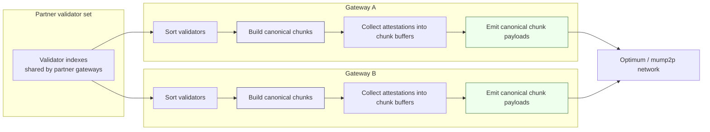
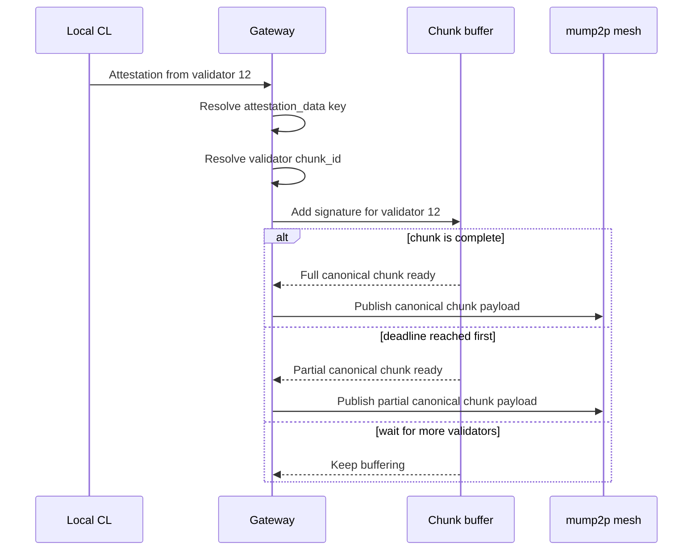
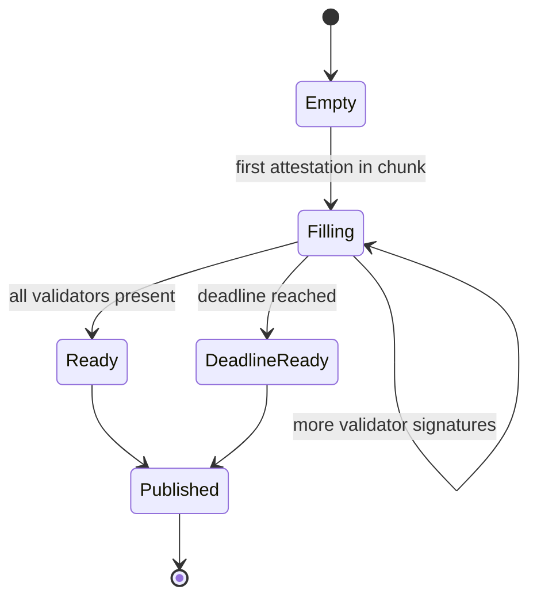

# ADR-0010: Deterministic Attestation Synchronization for Partner Gateway Clusters

**Status:** Approved (implementation pending)
**Date:** 2026-06-10

---

## 1. Context

This ADR extends the attestation work introduced in [ADR-008](./0008-attestation-subnet-boost.md) and [ADR-0009](./0009-slot-aware-attestation-gate.md).

In the current deployment model:

* multiple gateways can belong to the same partner,
* those gateways can share the same validator set
* the mump2p mesh is expected to accelerate propagation for that partner's validators rather than for the entire Ethereum attestation set.

Today, each gateway collects attestations from its local CL, batches them, and publishes them on a short timer. That is enough to reduce per-message overhead, but it does **not** guarantee that two gateways serving the same validators will construct the **same outbound payload**.

This matters because attestation traffic is highly redundant:

* Gateway A and Gateway B may both receive attestations for the same partner validators.
* They may receive them in different orders and at slightly different times.
* If they serialize batches differently, the resulting payload hashes differ even when the logical content is almost identical.
* Once that happens, RLNC / shard-based transport cannot efficiently exploit the overlap, because the source messages are no longer canonical.

### 1.1 Problem statement

We need a way for gateways serving the same partner validator set to:

1. construct **deterministic attestation payloads**,
2. minimize duplicate network traffic across the gateway cluster, and
3. avoid waiting indefinitely for slow or missing validators.

### 1.2 Current behavior

At the moment, attestation forwarding is effectively:

```sh
local CL receives attestations
        ↓
gateway filters to partner validators
        ↓
gateway batches on a timer
        ↓
gateway publishes whatever happened to be in the local buffer
```

This is good for basic batching, but not for cross-gateway synchronization.

---

## 2. Decision

Introduce **deterministic validator chunking** for outbound attestation synchronization inside a partner gateway cluster.

### 2.1 Canonical chunk assignment

Each gateway derives the same ordered validator list for the partner and splits it into fixed-size chunks.

Example:

```text
sorted validators:
[10, 11, 12, 13, 14, 15, 16, 17, 18, 19, 20, 21]

chunk size = 6

chunk 0 = [10, 11, 12, 13, 14, 15]
chunk 1 = [16, 17, 18, 19, 20, 21]
```

Because every gateway uses the same sorted list and the same chunk size, every gateway derives the **same chunk boundaries**.

### 2.2 Canonical per-chunk attestation message

For each attestation data key, a gateway accumulates validator signatures into the corresponding chunk buffer and serializes that buffer in a canonical order.

A conceptual chunk payload looks like this:

```text
ChunkAttestationMessage
  attestation_data
  chunk_id
  validators:
    10 -> signature_10
    11 -> signature_11
    12 -> signature_12
    13 -> signature_13
    14 -> signature_14
    15 -> signature_15
```

Canonicalization rules:

1. validator list is sorted ascending,
2. chunk boundaries are deterministic,
3. signatures are serialized in validator-index order,
4. missing validators are simply absent from the payload, not represented by local-only placeholders,
5. all gateways use the same encoding for the same `(attestation_data, chunk_id, validator->signature)` set.

If two gateways observe the same chunk contents, they emit the same payload bytes and therefore the same payload hash.

### 2.3 Publish policy

A chunk becomes publishable in either of these cases:

1. **Chunk complete** — all validators in the chunk have contributed for the current attestation data.
2. **Chunk deadline reached** — the gateway publishes the best partial chunk it has so propagation is not blocked by one slow or missing validator.

This keeps the design latency-safe: deterministic when possible, bounded-wait when necessary.

---

## 3. Data flow

### 3.1 Cluster-level view



### 3.2 Per-attestation flow



### 3.3 Chunk lifecycle



---

## 4. Rationale

### 4.1 Why chunk by validator set

Chunking turns the scaling factor from **number of validator attestations observed** into **number of canonical chunk messages emitted**.

Without chunking, two gateways can emit many near-duplicate batches. With chunking, they converge on the same small set of canonical payloads.

### 4.2 Why deterministic ordering matters

RLNC and other shard-oriented transport mechanisms benefit when multiple senders encode the **same source message**. The more often partner gateways produce byte-identical payloads, the better the network can exploit overlap instead of transporting slightly different encodings of the same information.

### 4.3 Why deadlines are required

Pure synchronization is unsafe if one validator is late or offline. A deadline ensures that one missing attestation does not hold back the rest of the chunk and does not create avoidable propagation latency.

---

## 5. Consequences

### Positive

* Higher probability that different partner gateways produce identical attestation payloads.
* Lower duplicate traffic across the gateway cluster.
* Better alignment between logical attestation overlap and RLNC source-message reuse.
* Bounded latency thanks to deadline-based partial flush.

### Negative / Trade-offs

* More state in the gateway: chunk maps, attestation-data grouping, and deadline tracking.
* More sensitivity to canonicalization bugs: if one gateway uses different ordering or encoding, synchronization benefits collapse.
* A chunk-level deadline can still produce partial overlap between gateways when they see different subsets before the deadline.
* Fixed chunk sizing may need tuning if validator distribution across partners is uneven.

---

## 6. Scope and non-goals

### In scope

* Deterministic outbound attestation grouping across gateways serving the same partner.
* Canonical chunk construction and serialization rules.
* Deadline-based partial publish for incomplete chunks.

### Out of scope

* Changing Ethereum attestation semantics.
* Changing inbound CL validation rules.
* Replacing the existing router-level validator filter from [ADR-008](./0008-attestation-subnet-boost.md).
* Replacing the slot-aware publish window from [ADR-0009](./0009-slot-aware-attestation-gate.md).

This ADR is an additional synchronization layer on top of those mechanisms, not a replacement for them.

---

## 7. Notes and open questions

Open implementation details to resolve before acceptance:

1. **Chunk size selection** — fixed global constant vs config.
2. **Attestation data keying** — exact canonical grouping key for chunk buffers.
3. **Deadline value** — static timeout vs slot-aware deadline derived from Ethereum timing.
4. **Partial flush dedup semantics** — whether a later fuller version of the same chunk supersedes or coexists with an earlier partial version.
5. **Telemetry** — metrics for chunk fill ratio, deadline-triggered flushes, and cross-gateway synchronization effectiveness.

---

## 8. Summary

The gateway cluster should stop publishing ad-hoc local attestation batches and instead publish **deterministic per-chunk attestation payloads** derived from the partner's shared validator set. This gives the network a stable message shape, reduces duplicate traffic, and preserves propagation speed by flushing incomplete chunks on a deadline instead of waiting forever.
