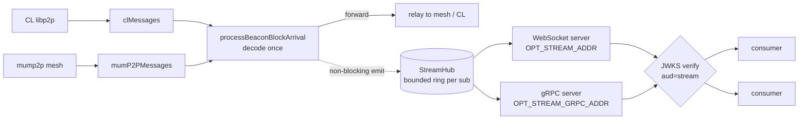

# ADR-0011: Gateway consumer block-stream API (WebSocket + gRPC)

**Status:** Approved (implementation pending)  
**Date:** 2026-08-05  

## Context

The gateway decodes every beacon block once in `processBeaconBlockArrival()`
(`pkg/service/gossipsub-gateway/beacon_block_measures.go`), fed by the
`clMessages` and `mumP2PMessages` channels. We want operators to expose that
already-decoded stream to their own downstream consumers over WebSocket or gRPC,
gated per consumer.

Today the only HTTP surface is `pkg/routes/base.go` (`/health`, `/metrics`,
`/api/v1/self_info`, `GETOnly`) — there is no inbound-consumer path.

Two constraints shape the design:

* **New trust axis.** Existing auth (`auth_token`, `jwks_verifier`) is the
  gateway ↔ control-plane relationship: `OPT_API_KEY` mints the gateway's own
  JWT, and peer JWTs are verified at the handshake (`aud=p2p` / `services`).
  Consumers are a different relationship — operator ↔ its own consumers — and
  must never see `OPT_API_KEY`. They get their own credential.
* **Never backpressure the mesh.** Relay latency is the SLA, so fan-out to
  consumers must be non-blocking against the ingest goroutines. A stalled client
  must not slow forwarding.

## Decision

Add an opt-in, read-only consumer stream, off by default (same opt-in shape as
the Obol overlay). Four parts.

### 1. Broadcast hub (`pkg/service/streamhub`)

`processBeaconBlockArrival` emits one `BlockEvent` per fresh block into a fan-out
hub. Each subscriber has a bounded ring buffer (default 64). On overflow the hub
drops the oldest event, bumps a `dropped` counter, and sends the client a
`lagged` frame. The emit from ingest is a non-blocking send — it never waits on a
consumer. At-most-once, no replay (see Non-goals).

### 2. Two transports, one hub

Both read-only — consumers cannot publish into the mesh.

* **WebSocket** — `GET /api/v1/stream/blocks` on its own listener
  (`OPT_STREAM_ADDR`) and Fiber app, so `/metrics` and `/health` stay off the
  exposed port. Params: `mode=metadata|raw`, `topics=beacon_block`.
* **gRPC** — `BlockStream.Subscribe(SubscribeRequest) returns (stream
  BlockEvent)` on `OPT_STREAM_GRPC_ADDR`, from a new
  `proto/getoptimum/optimum_gateway/service/stream/v1/stream.proto`.

### 3. Auth — reuse the JWKS verifier

Consumers present a JWT minted by `auth.getoptimum.io` for a new audience
`stream`, verified against the JWKS the gateway already caches
(`OPT_REMOTE_AUTH_URL`) via `pkg/service/jwks_verifier`. Add
`AudStream = "stream"` next to `AudP2P` / `AudServices`.

* Token in `Authorization: Bearer` (WS header or `Sec-WebSocket-Protocol`; gRPC
  metadata), verified **before** the WS upgrade / first stream frame.
* No scope claim in v1 — `aud=stream` is the authorization. There is one topic
  (`beacon_block`), so a valid stream token grants read of the whole stream. The
  gateway still caps connections per `sub` and globally and rate-limits events
  per connection, but those are config-driven, not per-token. (If topics beyond
  `beacon_block` are added later, a scope claim can gate them then.)
* The verifier sits behind a `ConsumerAuthenticator` interface so an
  operator-local key mode can replace central auth later without touching the
  transport or hub. Interface now, local impl later.

### 4. Config (opt-in, off by default)

| Env / yaml | Default | Purpose |
| --- | --- | --- |
| `OPT_STREAM_ENABLE` / `stream_enable` | `false` | Master switch for the consumer API. |
| `OPT_STREAM_ADDR` / `stream_addr` | `0.0.0.0:9600` | WebSocket/HTTP listener. |
| `OPT_STREAM_GRPC_ADDR` / `stream_grpc_addr` | `0.0.0.0:9601` | gRPC listener. |
| `OPT_STREAM_REQUIRE_AUTH` / `stream_require_auth` | `true` | Verify consumer JWTs; `false` only for local dev. |
| `OPT_STREAM_MAX_CONNS` | `256` | Global connection cap. |
| `OPT_STREAM_MAX_CONNS_PER_SUB` | `8` | Per-subject connection cap. |
| `OPT_STREAM_BUFFER_SIZE` | `64` | Per-connection ring buffer depth (drop-on-overflow). |

`OPT_REMOTE_AUTH_URL` (already present) supplies the JWKS/issuer.

### Data model — `BlockEvent`

Two modes, both from the existing decode point:

* **metadata**: `slot`, `proposer_index`, `parent_root`, `state_root`,
  `block_size_bytes`, `topic`, `source` (`libp2p`|`mump2p`), `received_at_ms`,
  `gateway_id`, `fork_digest`, `stale`.
* **raw**: the above plus the verbatim `ssz_snappy` bytes.

`DecodeBeaconBlockHeader` doesn't return a real `body_root`, so `block_root`
isn't cheaply derivable in metadata mode. It's left to raw mode (consumer-side)
or a later change rather than adding an SSZ decode on the hot path.

## Architecture

## Alternatives considered

* **Transport:** WS-only (no typed path) or gRPC-only (not browser-native).
  Chose both on one hub.
* **Auth:** operator-local static keys or operator-signed JWTs — self-contained,
  but the operator owns key storage, rotation, and revocation. Chose central
  JWKS and kept the `ConsumerAuthenticator` seam for a local mode later.
* **Payload:** metadata-only (can't reconstruct the block) or raw-only (least
  convenient). Chose both.

## Consequences

* New public surface means DoS exposure. Mitigations: auth-before-subscribe,
  connection caps (global + per-`sub`), per-connection rate cap, read/idle
  timeouts, max frame size, WS keepalive, TLS (proxy or native).
* Central-auth coupling, bounded by the `ConsumerAuthenticator` seam.
* Drop-on-lag means slow consumers miss events — surfaced via `lagged`/`dropped`
  rather than silently.
* Requires the auth service to mint `aud=stream` tokens.

## Non-goals (v1)

* Replay/backfill or a last-N buffer for late joiners.
* Topics beyond beacon blocks (attestations/aggregated later; a scope claim can
  gate them when they land).
* Any consumer write path — read-only, always.

## Implementation notes

* Emit `BlockEvent` from `processBeaconBlockArrival` after decode, non-blocking;
  keep `stale` blocks in the stream, flagged, rather than dropping them.
* New packages `pkg/service/streamhub` and `pkg/service/stream` (WS + gRPC + auth
  middleware), wired in `cmd/main.go` behind `OPT_STREAM_ENABLE`.
* Extend `pkg/service/jwks_verifier` with `AudStream`, behind
  `ConsumerAuthenticator`.
* Add `.../stream/v1/stream.proto`; run `make proto`.
* Tests via `pkg/test_utils` (`jwt_auth_claims.go`, `NewLocalBootstrapServerWithRig`):
  drop-on-lag fan-out, auth-reject-before-upgrade, and non-blocking ingest under
  a stalled consumer.
* Telemetry: connections (total and per-`sub`), events sent/dropped, auth
  failures, on the existing registry.
