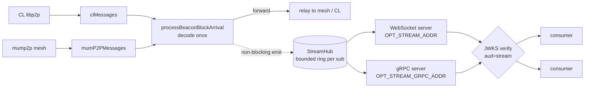

# ADR-0011: Gateway consumer block-stream API (WebSocket + gRPC)

**Status:** Approved (implemented)  
**Date:** 2026-08-05  

## Context

The gateway decodes each beacon-block arrival in `processBeaconBlockArrival()`
(`pkg/service/gossipsub-gateway/beacon_block_measures.go`), fed by the
`clMessages` and `mumP2PMessages` channels. We want operators to expose that
already-decoded stream to their own downstream consumers over WebSocket or gRPC,
gated per consumer.

Today the only HTTP surface is `pkg/routes/base.go` (`/health`, `/metrics`,
`/api/v1/self_info`, `GETOnly`) — there is no inbound-consumer path.

Two constraints shape the design:

* **New trust axis.** Existing auth (`auth_token`, `jwks_verifier`) is the
  gateway ↔ control-plane relationship: `OPT_API_KEY` mints the gateway's own
  JWT, and peer JWTs are verified at the handshake (`aud=p2p` / `services`).
  Consumers are a different relationship — operator ↔ its own consumers — and
  must never see `OPT_API_KEY`. They get their own credential.
* **Never backpressure the mesh.** Relay latency is the SLA, so fan-out to
  consumers must be non-blocking against the ingest goroutines. A stalled client
  must not slow forwarding.

## Decision

Add an opt-in, read-only consumer stream, off by default (same opt-in shape as
the Obol overlay). Four parts.

### 1. Broadcast hub (`pkg/service/streamhub`)

`processBeaconBlockArrival` runs **once per source observation** — before the
gateway's cross-path XXHash dedup (`isDuplicateMessage`) — so a block seen via
both libp2p and mump2p yields two events, one per `source`. The hub emits one
`BlockEvent` per observation into a fan-out. Event identity is
`(slot, proposer_index)`; consumers correlate the libp2p and mump2p views of the
same block by that identity and tell them apart by `source`.

The stream carries a small transport-neutral frame union, encoded per transport
(JSON/text over WS, proto over gRPC):

* `BlockEvent` — a block observation (metadata or raw; see Data model).
* `lagged` — a control frame sent after ring-buffer overflow, carrying the
  connection's cumulative `dropped` count so the consumer knows it missed events.

Each subscriber has a bounded ring buffer (default 64). On overflow the hub drops
the incoming event, increments the per-connection `dropped` counter, and sends a
`lagged` frame. The emit from ingest is a non-blocking send — it never waits on a
consumer, so a slow/stalled subscriber cannot backpressure ingest. At-most-once,
no replay (see Non-goals).

### 2. Two transports, one hub

Both read-only — consumers cannot publish into the mesh.

* **WebSocket** — `GET /api/v1/stream/blocks` on its own listener
  (`OPT_STREAM_ADDR`) and Fiber app, so `/metrics` and `/health` stay off the
  exposed port. Params: `mode=metadata|raw`, `topics=beacon_block`.
* **gRPC** — `BlockStreamService.Subscribe(SubscribeRequest) returns (stream
  BlockEvent)` on `OPT_STREAM_GRPC_ADDR`, from a new
  `proto/getoptimum/optimum_gateway/service/stream/v1/stream.proto`.

### 3. Auth — reuse the JWKS verifier

Consumers present a JWT minted by `auth.getoptimum.io` for a new audience
`stream`, verified against the JWKS the gateway already caches
(`OPT_REMOTE_AUTH_URL`) via `pkg/service/jwks_verifier`. Add
`AudStream = "stream"` next to `AudP2P` / `AudServices`.

* Token in the `Authorization` header for gRPC metadata and non-browser WS.
  Browsers cannot set WS request headers, so the token rides
  `Sec-WebSocket-Protocol`: the client offers two subprotocol values — a marker
  (`optimum.stream.v1`) and `bearer.<jwt>` — and the server authenticates from
  the `bearer.` value, selects **only the marker** as the negotiated subprotocol,
  and **never** echoes the token back as the selected subprotocol. Auth is
  verified **before** the subscriber is created / the WS upgrade completes;
  unauthenticated connections are rejected, never subscribed.
* No scope claim in v1 — `aud=stream` is the authorization. There is one topic
  (`beacon_block`), so a valid stream token grants read of the whole stream. The
  gateway still caps connections per `sub` and globally, but those caps are
  config-driven, not per-token. (If topics beyond `beacon_block` are added later,
  a scope claim can gate them then.)
* The verifier sits behind a `ConsumerAuthenticator` interface so an
  operator-local key mode can replace central auth later without touching the
  transport or hub. Interface now, local impl later.

### 4. Config (opt-in, off by default)

| Env / yaml                                                  | Default          | Purpose                                                         |
| ----------------------------------------------------------- | ---------------- | --------------------------------------------------------------- |
| `OPT_STREAM_ENABLE` / `stream_enable`                       | `false`          | Master switch for the consumer API.                             |
| `OPT_STREAM_ONLY` / `stream_only`                           | `false`          | Skip CL host/ingest; never publishes. Requires `stream_enable`. |
| `OPT_STREAM_ADDR` / `stream_addr`                           | `127.0.0.1:9600` | WebSocket/HTTP listener.                                        |
| `OPT_STREAM_GRPC_ADDR` / `stream_grpc_addr`                 | `127.0.0.1:9601` | gRPC listener.                                                  |
| `OPT_STREAM_REQUIRE_AUTH` / `stream_require_auth`           | `true`           | Verify consumer JWTs; `false` only for local dev.               |
| `OPT_STREAM_MAX_CONNS` / `stream_max_conns`                 | `256`            | Global connection cap.                                          |
| `OPT_STREAM_MAX_CONNS_PER_SUB` / `stream_max_conns_per_sub` | `8`              | Per-subject connection cap.                                     |
| `OPT_STREAM_BUFFER_SIZE` / `stream_buffer_size`             | `64`             | Per-connection ring buffer depth (drop-on-overflow).            |

`OPT_REMOTE_AUTH_URL` (already present) supplies the JWKS/issuer.

### 5. Exposure

Both listeners bind to loopback by default, matching `pprof_addr`. Exposing a
consumer feed on every interface is something the operator opts into, not what
happens when they flip `stream_enable`.

| Topology                                            | Requirement                                                           |
| --------------------------------------------------- | --------------------------------------------------------------------- |
| Loopback bind (the default)                         | Nothing further.                                                      |
| Private network — VPC peering, WireGuard, Tailscale | Nothing further; the network layer supplies the encryption TLS would. |
| Public network                                      | TLS required, via a trusted terminating proxy.                        |

**Enforced at startup** (`validateStreamListener`, `pkg/config/config.go`): a
non-loopback bind requires `stream_require_auth=true`. An empty host counts as
non-loopback, so `:9600` does not slip through. Disabling auth is allowed only on
a loopback bind, for local dev.

**Not enforced, and cannot be:** the TLS obligation itself — the gateway cannot
detect whether a proxy terminates TLS in front of it. Native TLS is deliberately
not implemented; the proxy is the intended path and every real deployment already
has one. These two sentences are kept separate on purpose: one is a runtime check,
the other is an operator obligation, and blurring them hides which is which.

What TLS protects here is **not** block confidentiality — blocks are public
consensus data already broadcast on a public p2p network. It is:

1. **The consumer JWT**, which travels in the `Authorization` header or in a
   `bearer.<jwt>` `Sec-WebSocket-Protocol` offer for browsers (`bearerToken`,
   `pkg/service/stream/ws.go`). In plaintext it is sniffable and replayable until
   expiry. The blast radius is bounded — the stream is read-only by design, the
   connection caps still apply, and the key is centrally revocable — so this is a
   commercial exposure (unpaid access), not a safety one.
2. **Feed integrity**, which cuts differently by mode; see Data model below.

Read/idle timeouts, max frame size, and the connection caps are the other DoS
mitigations — see Consequences.

### Data model — `BlockEvent`

Two modes, both from the existing decode point:

* **metadata**: `slot`, `proposer_index`, `parent_root`, `state_root`,
  `block_size_bytes`, `topic`, `source` (`libp2p`|`mump2p`), `received_at_ms`,
  `gateway_id`, `fork_digest`, `stale`.
* **raw**: the above plus the verbatim `ssz_snappy` bytes.

`DecodeBeaconBlockHeader` doesn't return a real `body_root`, so `block_root`
isn't cheaply derivable in metadata mode. It's left to raw mode (consumer-side)
or a later change rather than adding an SSZ decode on the hot path.

**What a consumer can verify.** The two modes carry different trust
requirements, and integrators need to know which they're in:

* **Raw mode degrades gracefully.** `Raw` is the verbatim `ssz_snappy`
  `SignedBeaconBlock`, so a consumer holding beacon state can check the proposer
  signature. Fabricated blocks are detectable consumer-side with no gateway
  signing.
* **Metadata mode does not.** `slot`, `proposer_index`, `parent_root`,
  `state_root` and friends arrive as gateway assertions with nothing to check
  them against.
* **Timing fields are unverifiable in both modes.** `received_at_ms`,
  `gateway_id`, and `stale` are gateway claims by construction — and for a
  latency-sensitive consumer they are the most valuable thing in the payload, so
  they are exactly what an on-path attacker would target.

**Metadata mode and all timing fields therefore require a trusted transport.**
Signing events gateway-side would close this without confidentiality, and the
gateway already holds an identity key — but it puts per-event crypto on a hot
path to reimplement, worse, what the proxy already provides. Not doing it.

## Architecture

## Alternatives considered

* **Transport:** WS-only (no typed path) or gRPC-only (not browser-native).
  Chose both on one hub.
* **Auth:** operator-local static keys or operator-signed JWTs — self-contained,
  but the operator owns key storage, rotation, and revocation. Chose central
  JWKS and kept the `ConsumerAuthenticator` seam for a local mode later.
* **Payload:** metadata-only (can't reconstruct the block) or raw-only (least
  convenient). Chose both.

## Consequences

* New public surface means DoS exposure — but only once an operator moves off the
  loopback default. Mitigations: auth-before-subscribe, connection caps (global +
  per-`sub`), read/idle timeouts, max frame size, WS keepalive, gRPC keepalive,
  TLS at the proxy.
* Central-auth coupling, bounded by the `ConsumerAuthenticator` seam.
* Drop-on-lag means slow consumers miss events — surfaced via `lagged`/`dropped`
  rather than silently.
* Requires the auth service to mint `aud=stream` tokens.

## Non-goals (v1)

* Replay/backfill or a last-N buffer for late joiners.
* Topics beyond beacon blocks (attestations/aggregated later; a scope claim can
  gate them when they land).
* Any consumer write path — read-only, always.
