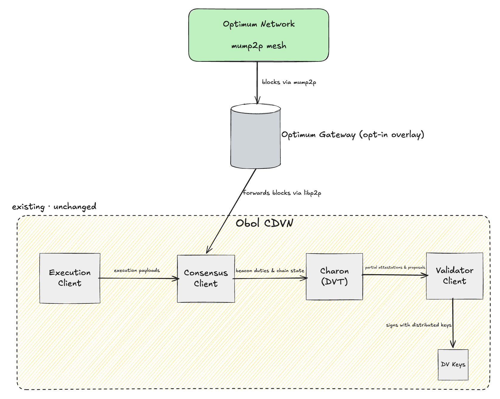

# Optimum Gateway overlay for Obol CDVN

Opt-in Docker Compose overlay that adds the Optimum Gateway to an [Obol Charon Distributed Validator Node (CDVN)](https://github.com/ObolNetwork/charon-distributed-validator-node). The gateway peers with the beacon node on the `dvnode` network so blocks arrive earlier via the mump2p mesh. Charon and the validator client are unchanged.

Off by default: omit the overlay from `COMPOSE_FILE` and the CDVN behaves exactly as before.

Partner install, API keys, and gateway config reference: [Gateway documentation (latest)](https://getoptimum.github.io/optimum-gateway/versions/latest/).

## How it connects



The gateway is an opt-in overlay: it receives early blocks from the Optimum mump2p mesh and forwards them to the consensus (beacon) client over libp2p. The Obol CDVN stack (execution client → consensus client → charon → validator client → DV keys) is partner-configured and unchanged. EL/CL/VC choice and charon cluster size are agnostic within supported CDVN clients.

## Prerequisites

- Running CDVN on Hoodi (or mainnet) with a CL beacon node (start with Lighthouse: `CL=cl-lighthouse`).
- Optimum API key (`ogw_live_...`) for your assigned `gateway_cluster_id` (Hoodi sample uses `optimum_hoodi_v0_2`).
- `curl` and `jq` on the host (for `init-optimum.sh`).

## Setup

From your CDVN root directory:

```bash
# 1. Copy overlay files into the CDVN tree
mkdir -p optimum
cp -R /path/to/integration/obol/* optimum/

# 2. Add Optimum vars to .env (see optimum/.env.optimum.sample)
echo 'OPT_API_KEY=ogw_live_...' >> .env
echo 'GATEWAY_VERSION=v1.1.1' >> .env

# 3. Enable the overlay (append to existing COMPOSE_FILE)
# Example:
# COMPOSE_FILE=compose-el.yml:compose-cl.yml:compose-vc.yml:compose-mev.yml:docker-compose.yml:optimum/compose-optimum.yml

# 4. Start CDVN (CL must be up before init)
docker compose up -d

# 5. Write gateway config with CL peer id (Approach A)
chmod +x optimum/init-optimum.sh
./optimum/init-optimum.sh

# 6. Start (or restart) the gateway
docker compose up -d optimum-gateway
```

`init-optimum.sh` reads `CL` and `CL_PORT_HTTP` from your CDVN `.env`, calls `GET /eth/v1/node/identity`, and writes `optimum/config/app_conf.yml` with:

```yaml
direct_cl_peers:
  - /dns4/cl-lighthouse/tcp/9000/p2p/<cl_peer_id>
```

No CL command edits are required (Approach A). The gateway dials the CL on the Docker `dvnode` network.

## Verify

```bash
curl -s http://localhost:48123/health | jq '{status, checks: {cl_peers: .checks.cl_peers, mump2p_peers: .checks.mump2p_peers}}'
curl -s http://localhost:48123/api/v1/self_info | jq '{peer_id, libp2p_peers: .libp2p.total_peers, direct_peers: .libp2p.direct_peers}'

# Optional: confirm CL sees gateway (Lighthouse REST wraps peer under .data)
GW_PEER=$(curl -s http://localhost:48123/api/v1/self_info | jq -r '.peer_id')
curl -s "http://127.0.0.1:5052/eth/v1/node/peers/${GW_PEER}" | jq '.data | {state, direction}'
```

When connected: `checks.cl_peers >= 1`.

## Disable

Remove `:optimum/compose-optimum.yml` from `COMPOSE_FILE` and run `docker compose up -d`. Stock CDVN behaviour is restored.

## Supported CL clients

Any CDVN CL on P2P port `9000` and REST `5052` (`cl-lighthouse`, `cl-lodestar`, `cl-teku`, `cl-prysm`, `cl-nimbus`, `cl-grandine`). Set `CL` in `.env` before running `init-optimum.sh`.

## Approach B (fallback)

If Hoodi validation shows the CL must explicitly trust the gateway (e.g. Lighthouse `--trusted-peers` / `--boot-nodes`), add a per-CL compose override that re-declares the CL command. See the HOP full stack in [`integration/ethereum/`](../ethereum/) for gateway peer discovery in that direction. Prototype Approach A first.

## Files

```text
integration/obol/
├── compose-optimum.yml      # Append to CDVN COMPOSE_FILE
├── config/
│   └── sample.app_conf.yml  # Template; init writes app_conf.yml
├── init-optimum.sh          # Discover CL peer id, write config
├── obol_integration.png     # Architecture diagram
├── .env.optimum.sample      # Vars to add to CDVN .env
├── .gitignore
└── README.md
```

When copied into a CDVN, paths in `compose-optimum.yml` expect `./optimum/config` and `./optimum/identity/` relative to the CDVN root.
